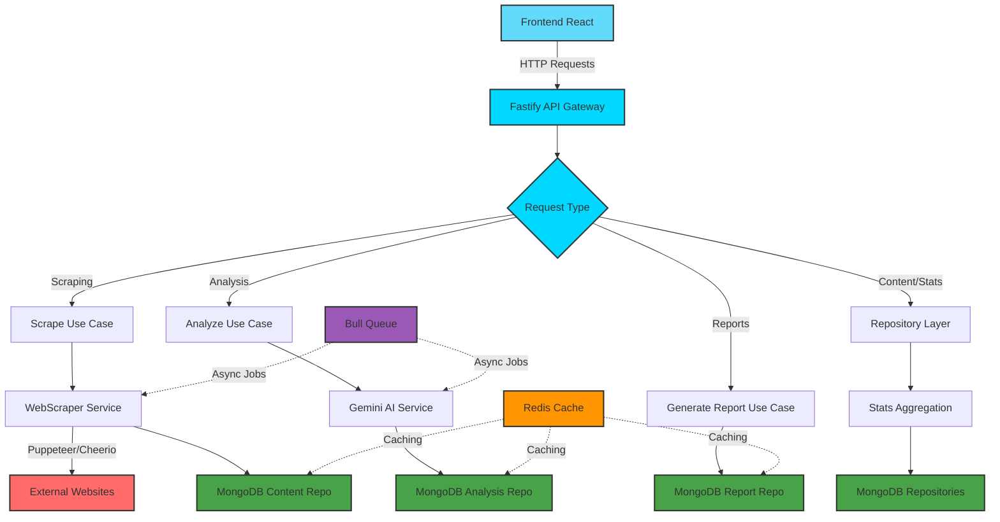

# 🧪 AI Content Analytics Platform

> Intelligent web scraping and content analysis platform powered by Google Gemini AI

[]()
[]()
[]()
[]()
[]()
[]()

## 📋 Overview

Advanced platform for web content extraction, AI-powered analysis using Google Gemini, and interactive data visualization. Perfect for content marketers, researchers, and data analysts.

## ✨ Key Features

- 🔍 **Intelligent Web Scraping**: Automated content extraction from articles and blogs
- 🤖 **AI-Powered Analysis**: Gemini AI integration for sentiment, topics, and insights
- 📊 **Interactive Dashboards**: Real-time charts and analytics with Recharts/Chart.js
- 🐿 **Queue System**: Bull/BullMQ for async scraping jobs
- 🗄️ **NoSQL Storage**: MongoDB for flexible document storage
- 🔒 **Authentication**: JWT-based secure access
- 🚀 **Performance**: Redis caching for optimized queries

## 🏗️ Architecture

### Data Flow Architecture



### Hexagonal Architecture

```
backend/
├── src/
│   ├── domain/
│   │   ├── entities/       # Content, Analysis, Report
│   │   └── repositories/   # Interfaces
│   ├── application/
│   │   ├── use-cases/      # Scrape, Analyze, Generate
│   │   └── services/       # AI, Queue services
│   └── infrastructure/
│       ├── database/       # MongoDB adapters
│       ├── scraper/        # Cheerio/Puppeteer
│       ├── ai/             # Gemini integration
│       └── http/           # Fastify routes
```

## 🚀 Tech Stack

**Frontend:**
- React 18 + TypeScript
- TailwindCSS
- Recharts / Chart.js
- React Query
- Axios

**Backend:**
- Fastify (high-performance)
- TypeScript
- MongoDB + Mongoose
- Redis
- Bull Queue
- Google Gemini AI API
- Cheerio / Puppeteer

## 🐳 Quick Start

```bash
# Clone repository
git clone https://github.com/andremlopesbr/ai-content-analytics-platform.git
cd ai-content-analytics-platform

# Environment setup
cp .env.example .env

# Start with Docker
docker-compose up -d

# Access
# Frontend: http://localhost:3000
# Backend: http://localhost:3001
# MongoDB: mongodb://localhost:27017
```

## 📦 Services

| Service  | Port  | Description     |
| -------- | ----- | --------------- |
| Frontend | 3000  | React dashboard |
| Backend  | 3001  | Fastify API     |
| MongoDB  | 27017 | Database        |
| Redis    | 6379  | Cache           |

## 📚 API Endpoints

### Content Management
| Method | Endpoint           | Description             | Request Body                                                             | Response                            |
| ------ | ------------------ | ----------------------- | ------------------------------------------------------------------------ | ----------------------------------- |
| `POST` | `/api/scrape`      | Scrape content from URL | `url` (required), `title`, `author`, `publishedAt`, `tags[]`, `metadata` | Content object + `scraped: boolean` |
| `GET`  | `/api/content/:id` | Get content by ID       | -                                                                        | Content details                     |

### AI Analysis
| Method | Endpoint       | Description             | Request Body                                                                                              | Response                            |
| ------ | -------------- | ----------------------- | --------------------------------------------------------------------------------------------------------- | ----------------------------------- |
| `POST` | `/api/analyze` | Analyze content with AI | `contentId` (required), `analysisType` (optional: sentiment/topics/keywords/summary/entities), `metadata` | Analysis object + `queued: boolean` |

### Reports & Analytics
| Method | Endpoint                | Description               | Query Params                                                                                                                                                | Response                                                             |
| ------ | ----------------------- | ------------------------- | ----------------------------------------------------------------------------------------------------------------------------------------------------------- | -------------------------------------------------------------------- |
| `GET`  | `/api/reports`          | List reports with filters | `type`, `generatedBy`, `limit` (1-100), `offset`                                                                                                            | Reports array + total count                                          |
| `POST` | `/api/reports/generate` | Generate new report       | `title` (required), `type` (required: content_summary/trend_analysis/performance_metrics/custom), `contentIds[]`, `analysisIds[]`, `filters`, `generatedBy` | Report object                                                        |
| `GET`  | `/api/stats`            | Get platform statistics   | -                                                                                                                                                           | Comprehensive stats (contents, analyses, reports, status breakdowns) |

### Scraping-Specific Endpoints
| Method                 | Endpoint                         | Description                        | Notes                             |
| ---------------------- | -------------------------------- | ---------------------------------- | --------------------------------- |
| Batch scraping support | `/api/scrape` with multiple URLs | Process multiple URLs in sequence  | Returns array of results          |
| Content deduplication  | Automatic URL-based              | Prevents duplicate scraping        | Returns existing content if found |
| Rate limiting          | Built-in via Bull Queue          | Prevents overwhelming target sites | Configurable concurrency          |

## 🧪 AI Features

- **Sentiment Analysis**: Detect positive/negative/neutral tones
- **Topic Extraction**: Identify main themes
- **Summarization**: Generate concise summaries
- **Entity Recognition**: Extract names, places, organizations
- **Trend Detection**: Identify content patterns

## 🔧 Development

```bash
# Install dependencies
npm install

# Run dev mode
npm run dev

# Run tests
npm test

# Build for production
npm run build
```

## 🌍 Environment Variables

```env
# Database
MONGODB_URI=mongodb://localhost:27017/analytics

# Redis
REDIS_URL=redis://localhost:6379

# Gemini AI
GEMINI_API_KEY=your_gemini_api_key

# Authentication
JWT_SECRET=your_jwt_secret
```

## 🚧 Roadmap

- [ ] Multiple AI providers (OpenAI, Claude)
- [ ] Scheduled scraping
- [ ] Export reports (PDF, CSV)
- [ ] Multi-language support
- [ ] Browser extension

## 👤 Author

**André Lopes**
- GitHub: [@andremlopesbr](https://github.com/andremlopesbr)

## 🙏 Acknowledgments

- Google Gemini AI for intelligent analysis
- Full Cycle architecture patterns
- Clean Architecture principles

---

⭐ Star this repo if useful!
